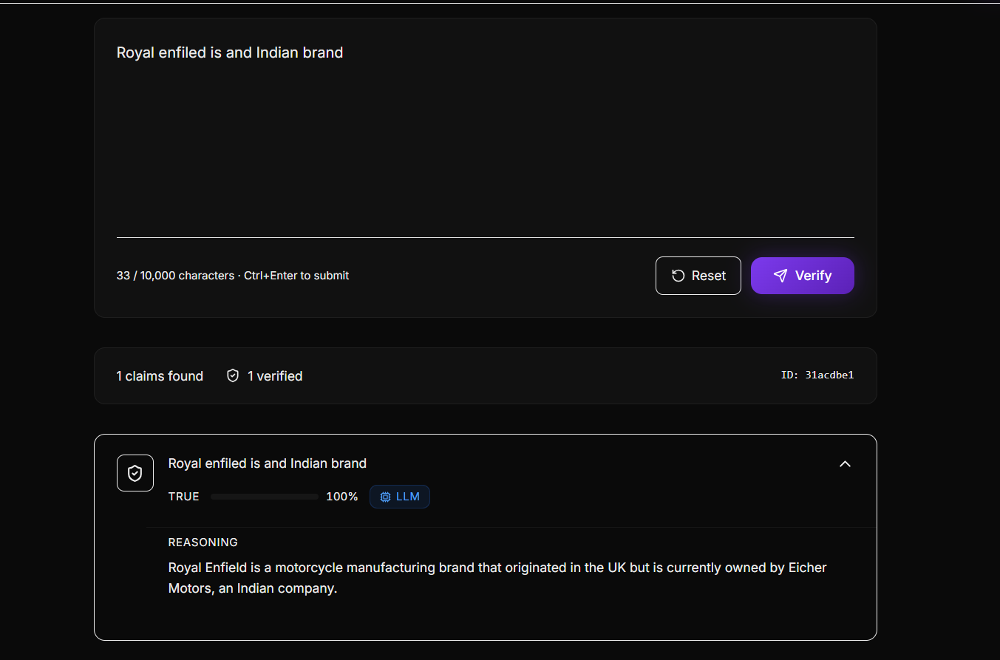
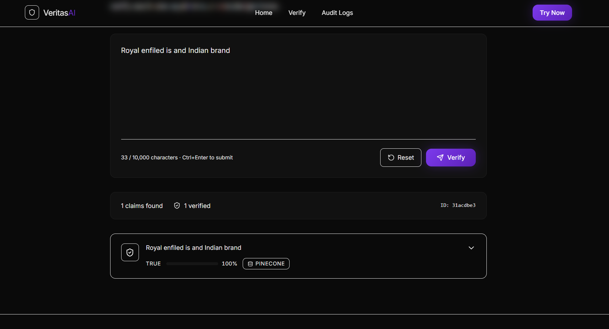

# 🚀 VeritasAI — AI Hallucination Detection System

VeritasAI is a full-stack middleware that detects and verifies hallucinations in LLM outputs by breaking responses into factual claims and validating them using vector search and LLM-based scoring.

> Built to solve a real problem: LLMs generating incorrect or fabricated information.

---

## 🧠 Problem

LLMs often produce confident but incorrect answers (hallucinations), making them unreliable for critical use cases.

VeritasAI introduces a verification layer that ensures responses are:

* Fact-checked
* Evidence-backed
* Auditable

---

## 🔍 What it Does

* Splits LLM responses into individual claims
* Matches claims against a vector database (Pinecone)
* Verifies using knowledge base or LLM fallback
* Returns verdict with confidence and reasoning
* Logs all verifications for auditing

---

## 📸 Demo

### 🧠 LLM Response → Claim Extraction  
Breaks LLM output into individual factual claims  



---

### 🔍 Verification → Final Verdict  
Validates claims using vector search and returns confidence score  



## 🔄 System Flow

LLM Response
→ Claim Extraction
→ Embedding Generation
→ Vector Search (Pinecone)
→ Verification (KB or LLM fallback)
→ Scoring + Confidence
→ Audit Logging

---

## ⚙️ Tech Stack

* **Backend:** Node.js, Express
* **Frontend:** React (Vite)
* **Database:** MongoDB
* **Vector DB:** Pinecone
* **LLM:** Groq (LLaMA 3.3 70B)
* **Embeddings:** MiniLM-L6-v2 (local)

---

## 🔬 Verification Pipeline

1. **Claim Extraction**
   Extracts factual claims from LLM output

2. **Embedding**
   Converts each claim into vector form (384-dim)

3. **Vector Search**
   Retrieves closest matches from Pinecone

4. **Verification Routing**

   * Similarity ≥ 0.75 → use KB evidence
   * Else → fallback to LLM

5. **Scoring**
   Generates verdict + confidence

6. **Audit Logging**
   Stores results in MongoDB (TTL-based cleanup)

---

## 🔥 Key Features

* Claim-level hallucination detection
* Hybrid verification (Vector DB + LLM)
* Auto-learning (verified claims cached)
* Deduplication to reduce redundant calls
* Graceful failure handling
* API-ready architecture

---

## ⚔️ Challenges & Learnings

* Designing claim-level verification instead of full-response validation
* Handling low similarity cases in vector search
* Reducing unnecessary LLM calls
* Managing latency in multi-step pipeline

---

## 🚀 Future Improvements

* Real-time streaming verification
* Improved claim extraction accuracy
* Feedback loop for better verification
* Caching for performance optimization

---

## 🏗️ Project Structure

```
veritasAI/
├── backend/
│   ├── config/
│   ├── middleware/
│   ├── models/
│   ├── routes/
│   ├── services/
│   └── utils/
│
└── frontend/
    ├── components/
    ├── pages/
    └── api/
```

---

## 🛠️ Setup

### Backend

```
cd veritasAI-backend
npm install
cp .env.example .env
npm run seed
npm start
```

### Frontend

```
cd veritasAI-frontend
npm install
cp .env.example .env.local
npm run dev
```

---

## 🔌 API

### POST /api/verify

```json
{
  "llmResponse": "The speed of light is 300,000 km/s"
}
```

---

## 📄 License

MIT License
